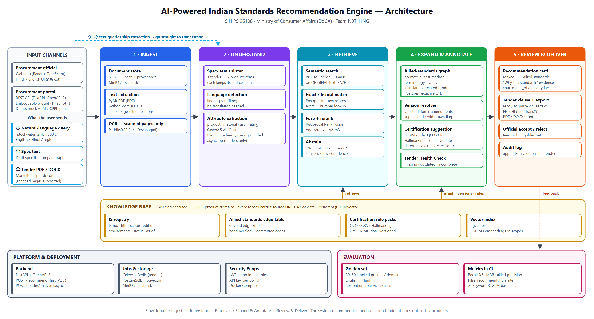

# AI-Powered Recommendation Engine for Identifying Applicable Indian Standards for Procurement Specifications

**Smart India Hackathon · Problem Statement 26108** · Ministry of Consumer Affairs, Food & Public Distribution, Department of Consumer Affairs · Team N0TH1NG

This is a baseline prototype. A procurement official describes a product, or uploads a tender, and the engine returns:

- the applicable **Indian Standard(s)**, ranked, with the evidence for each match;
- **allied standards** grouped into the six types named in the PS: normative references, test methods, terminology, safety, installation and related products;
- the **current edition** of each standard, and a flag when the input cites an outdated edition;
- **certification requirements** (ISI Mark under a QCO, CRS or Hallmarking), with the order they come from;
- a **ready-to-paste tender clause** in English or Hindi.

It also runs a **Tender Health Check**: for every item in an uploaded tender it flags missing standards, outdated editions, missing test-method or safety standards, and certification the item does not ask for.



## Quick start (Docker: Linux, Windows, macOS)

The whole app (API + web UI) runs in **one Docker container**. The same image works on Linux, Windows (Docker Desktop with WSL 2) and macOS (Intel and Apple Silicon). The only requirement is [Docker Desktop](https://www.docker.com/products/docker-desktop/) or Docker Engine with the Compose plugin.

```bash
docker compose up -d --build
```

Then open <http://localhost:8000>. The interactive API documentation is at <http://localhost:8000/docs>.

| Task | Command |
|---|---|
| Live server log | `docker compose logs -f app` |
| Log analysis report | `docker compose exec app python -m app.log_report` (add `--since 2026-10-01` or `--json`) |
| Run the tests | `docker compose run --rm app python -m pytest -q` |
| Run the evaluation | `docker compose run --rm app python -m eval.run_eval` |
| Stop | `docker compose down` |
| Semantic retrieval (BGE-M3) | `INSTALL_ML=true docker compose up -d --build`, or set it in `.env` (see `.env.example`) |

**What is kept on the host**

| Host folder | Contents |
|---|---|
| `logs/` | `server.jsonl`: one JSON object per log line (every API request with method, path, status, latency, client and request ID; uploads with file name, size and result; warnings and errors with tracebacks). It rotates daily (`server.jsonl.YYYY-MM-DD`) and keeps 30 days by default (`ISRE_LOG_RETENTION_DAYS`). Every response carries an `X-Request-ID` header that matches its log line. |
| `backend/var/` | Hash-chained audit log (`audit.jsonl`) and uploaded documents |

The JSON-lines format loads directly into pandas (`pd.read_json("logs/server.jsonl", lines=True)`), `jq`, Elastic or Loki.

**If the build fails with `SSLError ... UNEXPECTED_EOF_WHILE_READING`** while pip downloads packages, the network between Docker and PyPI is dropping connections (common on VPNs, mobile hotspots and some campus networks). It is not a problem with the project. Run `docker compose build` again: packages that already downloaded are cached, so each attempt only fetches what is missing. If it keeps failing, disconnect the VPN, or point pip at a mirror by setting `PIP_INDEX_URL` in `.env` (see `.env.example`).

**Without Docker (development).** With Python 3.11+ and Node.js 18+: `pip install -r backend/requirements.txt`, `cd frontend && npm install && npm run build`, then from `backend/` run `uvicorn app.main:app --port 8000`. Logs go to `logs/` here too. For front-end hot reload, run `npm run dev` in `frontend/` (port 5173, proxies `/api`).

**Demo links**

- `http://localhost:8000/?q=LED%20street%20light%2090%20W` runs a search on page load.
- `http://localhost:8000/?tab=tender&sample=02` runs the Health Check on a sample tender. Use `01` to `06`; see [samples/README.md](samples/README.md).

**Sample tenders** (`samples/`, each in TXT, DOCX and PDF):

| Sample | Project | Expected result |
|---|---|---|
| `01_office_complex_construction` | Administrative Block, Central Government Office Complex | Acceptable |
| `02_district_hospital_electrification` | Electrification and Water Supply Works, District Hospital | Partially acceptable |
| `03_engineering_college_hostel` | Boys Hostel, State Engineering College | Not acceptable |
| `04_regional_office_facility_services` | Facility Management Services, Regional Office (services only) | No Indian Standard applies |
| `05_government_school_building` | Government School Building (Hindi tender) | Partially acceptable |
| `06_engineering_college_hostel_scanned` | Scanned copy of 03 (PDF, no text layer) | Could not read document (OCR needed) |

## How the code maps to the architecture

| Stage | Module | What it does in this baseline |
|---|---|---|
| 1 · Ingest | `backend/app/pipeline/ingest.py` | Stores each upload by SHA-256. Extracts text with PyMuPDF (PDF) or python-docx (DOCX, tables included). Detects scanned pages and runs PaddleOCR on them if it is installed. |
| 2 · Understand | `backend/app/pipeline/understand.py` | Splits a tender into numbered items and keeps their line ranges. Detects the script for Hindi and 8 other Indian languages. Extracts attributes (materials, grades, quantities) with rules, or with Qwen2.5 via Ollama when it is configured. |
| 3 · Retrieve | `backend/app/pipeline/retrieve.py` | BM25 with a Hindi/Hinglish glossary, plus exact IS-number matching. **BGE-M3** dense retrieval switches on when it is installed. Results are fused with Reciprocal Rank Fusion; a bge-reranker cross-encoder is optional. The engine abstains below a confidence threshold. |
| 4 · Expand & Annotate | `backend/app/pipeline/expand.py` | Expands allied standards over typed graph edges, resolves versions, suggests certification from the YAML rule pack, and runs the tender health check. |
| 5 · Review & Deliver | `backend/app/pipeline/deliver.py`, `backend/app/audit.py` | Builds tender clauses in English and Hindi. Records accept/reject decisions in a hash-chained, append-only audit log. |
| Knowledge base | `backend/data/` | `standards.json` (registry), `edges.json` (allied graph), `certification_rules.yaml` (rule pack), `glossary.json` |
| Portal API | `backend/app/main.py` | FastAPI + OpenAPI 3 |
| Web app | `frontend/` | React + TypeScript (Vite) |

## API

| Method | Endpoint | Purpose |
|---|---|---|
| POST | `/api/recommend` | `{"query": "...", "top_k": 5, "output_language": "en" \| "hi"}` |
| POST | `/api/tender/analyse` | multipart `file` (PDF / DOCX / TXT, max 10 MB), `?output_language=` |
| GET | `/api/standards` | Registry listing, filters `domain` and `category` |
| GET | `/api/standards/{id}` | One standard with its version and certification |
| GET | `/api/standards/{id}/allied` | Allied standards grouped by type |
| POST | `/api/feedback` | `{"request_id", "standard_id", "decision": "accept" \| "reject"}` |
| GET | `/api/audit/verify` | Checks the audit log's hash chain |
| GET | `/api/health` | Engine status, retrieval mode, data date |

## Semantic retrieval (optional, recommended for the demo)

By default the engine runs a lexical baseline, so it works offline with no model download. To turn on BGE-M3 multilingual embeddings, build with the ML extras (about 2.5 GB model download on first run, cached in the `models` Docker volume):

```bash
INSTALL_ML=true ISRE_RERANK_MODEL=BAAI/bge-reranker-v2-m3 docker compose up -d --build   # reranker is optional
```

`/api/health` and the web app show which retrieval mode is active.

| Variable | Default | Meaning |
|---|---|---|
| `ISRE_DENSE` | `auto` | `off` forces the lexical baseline |
| `ISRE_EMBED_MODEL` | `BAAI/bge-m3` | Dense embedding model |
| `ISRE_RERANK_MODEL` | *(empty)* | Cross-encoder reranker |
| `ISRE_OLLAMA_MODEL` | *(empty)* | For example `qwen2.5:7b-instruct` for LLM attribute extraction |
| `ISRE_ABSTAIN_THRESHOLD` | `0.30` | Below this confidence the engine reports "no applicable IS" |
| `ISRE_OLLAMA_URL` | `http://host.docker.internal:11434` in Docker | Ollama server on the host |
| `ISRE_LOG_DIR` | `logs/` (`/data/logs` in the container) | Where `server.jsonl` is written |
| `ISRE_LOG_LEVEL` | `INFO` | `DEBUG`, `INFO`, `WARNING` or `ERROR` |
| `ISRE_LOG_RETENTION_DAYS` | `30` | Daily log files kept before deletion |

## Tests and evaluation

```bash
docker compose run --rm app python -m pytest -q        # API, parser, Hindi, abstention, tender health check
docker compose run --rm app python -m eval.run_eval    # Recall@5, MRR, abstention accuracy
```

Current lexical baseline on `eval/golden.json` (28 queries: 24 with an answer, 4 with none): **Recall@5 1.00 · MRR 0.98 · 4/4 correct abstentions.** These numbers are optimistic. The golden set was written by the team against the same seed data. It needs to grow to 30–50 independently labelled queries per domain before the numbers mean anything.

## Data: read before using

`backend/data/` is an **illustrative seed** covering 37 standards in 5 product domains: steel reinforcement, power cables, LED street lighting, gold jewellery, and water storage and pipes.

- The scope texts are short paraphrases written by the team, not BIS text.
- Editions, amendments, allied links and certification orders were compiled for the prototype and are marked `verified: false`. The UI and API show this, along with the `as_of` date.
- Amendment lists and effective dates of certification orders are left blank until they are checked.
- Before any real use, verify every record against the BIS Standards Portal and the official Quality Control Order notifications.

The engine is built so that incomplete data shows up as "to verify", never as a confident answer.

## Not in this baseline yet

- PostgreSQL + pgvector storage. The registry is loaded from JSON. Only the loader in `knowledge.py` needs to change.
- An asynchronous job queue (Celery + Redis) for large tenders. Analysis is currently synchronous.
- Authentication (JWT login and per-portal API keys).
- IndicTrans2 translation of free-form output. Hindi output currently uses fixed clause templates.
- An embeddable `<script>` widget build and a mock GeM page.
- A scheduled refresh of the registry from BIS.
